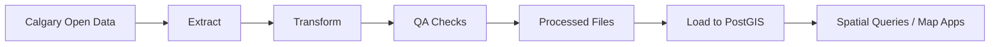

# Junior GIS Developer Portfolio - Project 1 Guide

## Project 1: Calgary Spatial ETL Pipeline (Python + PostGIS)

## 1. Why This Project Matters
This project demonstrates the core capability hiring teams expect from a junior GIS developer: turning messy public geospatial data into clean, queryable, and repeatable data products.

By the end, you will have a portfolio-ready workflow that:
- Downloads real municipal data.
- Cleans and validates geometries and schemas.
- Reprojects and standardizes fields.
- Loads data into PostGIS with indexes.
- Produces a QA report for reproducibility.

## 2. What You Will Build
You will build an end-to-end ETL pipeline with this flow:
1. Extract: fetch selected City of Calgary open datasets.
2. Transform: normalize CRS, clean geometry, standardize columns.
3. Validate: run quality checks and output a QA summary.
4. Load: write clean layers to PostGIS and create spatial indexes.
5. Deliver: export an analysis-ready GeoPackage plus QA CSV.

## 3. Suggested Datasets (Calgary Open Data)
Use 3-4 layers only for a clean first project scope.

Recommended starter layers:
- Community boundaries
- Road centerlines or road network
- Transit stops or stations
- Land use districts (optional if available)

Resource links:
- City of Calgary Open Data portal: https://data.calgary.ca/
- Open Government Portal (Canada): https://open.canada.ca/data/en/dataset
- Alberta Open Data: https://open.canada.ca/data/en/dataset?organization=ab

Notes:
- Confirm each dataset license and citation requirements in your README.
- Prefer GeoJSON, CSV with coordinates, or shapefile exports for easy ingestion.

## 4. Tech Stack and Skills You Will Showcase
- Python: pandas, geopandas, shapely, pyproj
- Database: PostgreSQL, PostGIS
- Automation: command-line runnable scripts
- QA: reproducible data checks and summary metrics
- Documentation: professional README and architecture notes

## 5. Project Structure (Create This First)
Use this folder layout:

```text
calgary-spatial-etl/
  README.md
  environment.yml
  requirements.txt
  .gitignore
  data/
    raw/
    processed/
  outputs/
    qa/
    logs/
  sql/
    init.sql
  src/
    config.py
    extract.py
    transform.py
    qa.py
    load.py
    main.py
  docs/
    architecture.md
```

## 6. Step-by-Step Implementation

### Step 1: Initialize Repo and Environment
Goal: create a clean, reproducible development setup.

Tasks:
1. Create project folder and initialize git.
2. Create `environment.yml` in the project root.
3. Save the YAML content into `environment.yml`.
4. Create the conda environment from that file.
5. Verify the file exists in the project root.

Suggested commands:
```bash
mkdir calgary-spatial-etl && cd calgary-spatial-etl
git init
cat > environment.yml << 'YAML'
name: calgary-etl
channels:
  - conda-forge
dependencies:
  - python=3.11
  - pandas
  - geopandas
  - shapely
  - pyproj
  - proj
  - proj-data
  - fiona
  - sqlalchemy
  - psycopg2
  - pip
  - pip:
      - python-dotenv
      - pyyaml
YAML

  conda env create -f environment.yml
  conda activate calgary-etl

  # optional: only if you need to update the file later
  # conda env update -f environment.yml --prune

  # if you prefer pip for extras, install them after activation
  # pip install pandas geopandas shapely pyproj fiona sqlalchemy psycopg2-binary python-dotenv pyyaml
pip freeze > requirements.txt
```

Recommended `environment.yml` (minimal):
```yaml
name: calgary-etl
channels:
  - conda-forge
dependencies:
  - python=3.11
  - pandas
  - geopandas
  - shapely
  - pyproj
  - proj
  - proj-data
  - fiona
  - sqlalchemy
  - psycopg2
  - pip
  - pip:
      - python-dotenv
      - pyyaml
```

Done criteria:
- Environment builds successfully.
- `environment.yml` exists at the project root.
- `ls environment.yml` works from the project root.
- `proj` and `proj-data` are included so `pyproj` can find its PROJ database.
- `python -c "import geopandas"` runs without error.

### Step 2: Prepare PostGIS
Goal: create a database target for your cleaned spatial layers.

Tasks:
1. Use Docker for PostgreSQL + PostGIS in WSL.
2. Start a PostgreSQL/PostGIS container.
3. Create the `calgary_gis` database.
4. Enable the PostGIS extension.

Why Docker is recommended here:
- It keeps the database setup reproducible across machines.
- It avoids mixing Windows, WSL, and local database installs.
- It is a practical employer-facing skill because many teams use containers for development and deployment.

Suggested Docker Compose setup:

1. Make sure Docker Desktop is installed on Windows and WSL integration is enabled.
2. Save the `docker-compose.yml` file in the project root.
3. Start the database service from the project root.
4. Connect to the container and create the database.
5. Verify PostGIS is available.

Commands:

```bash
# start the PostGIS container defined in docker-compose.yml
docker compose up -d

# confirm the container is running
docker compose ps

# open a shell inside the running container
docker compose exec postgis psql -U postgres -d postgres
```

Inside the `psql` prompt, run:

```sql
CREATE DATABASE calgary_gis;
\c calgary_gis;
CREATE EXTENSION IF NOT EXISTS postgis;
CREATE EXTENSION IF NOT EXISTS postgis_topology;
SELECT PostGIS_Version();
```

Quick verification from the terminal:

```bash
docker compose exec postgis psql -U postgres -d calgary_gis -c "SELECT PostGIS_Version();"
```

Optional cleanup:

```bash
docker compose down
```

Why keep the same SQL in `sql/init.sql`:
- The SQL above is what you run interactively in `psql`.
- Saving it in `sql/init.sql` gives you a reusable script for repeat setup.
- This is useful if you rebuild the container or need to recreate the database quickly.

Step-by-step script workflow (recommended):

1. Create the SQL file once in your project:

```bash
cat > sql/init.sql << 'SQL'
CREATE DATABASE calgary_gis;
\c calgary_gis;
CREATE EXTENSION IF NOT EXISTS postgis;
CREATE EXTENSION IF NOT EXISTS postgis_topology;
SQL
```

2. Make sure the Docker service is running:

```bash
docker compose up -d
docker compose ps
```

3. Run the SQL script from your project root:

```bash
docker compose exec -T postgis psql -U postgres -d postgres -f sql/init.sql
```

4. Verify PostGIS in the target database:

```bash
docker compose exec postgis psql -U postgres -d calgary_gis -c "SELECT PostGIS_Version();"
```

Hands-on checklist for Step 2 (type these yourself):

1. Start database service:

```bash
docker compose up -d
docker compose ps
```

2. Create `sql/init.sql` manually:

```bash
cat > sql/init.sql << 'SQL'
CREATE DATABASE calgary_gis;
\c calgary_gis;
CREATE EXTENSION IF NOT EXISTS postgis;
CREATE EXTENSION IF NOT EXISTS postgis_topology;
SQL
```

3. Confirm the file exists:

```bash
ls -l sql/init.sql
cat sql/init.sql
```

4. Run the script:

```bash
docker compose exec -T postgis psql -U postgres -d postgres -f sql/init.sql
```

5. Verify PostGIS:

```bash
docker compose exec postgis psql -U postgres -d calgary_gis -c "SELECT PostGIS_Version();"
```

Notes:
- If `service "postgis" is not running`, start it with `docker compose up -d`.
- If `database "calgary_gis" already exists`, your setup already succeeded earlier; this is normal on re-runs.

Done criteria:
- `SELECT PostGIS_Version();` returns a version.
- The `postgis` service is running and reachable from WSL.

### Step 3: Build Extract Module
Goal: programmatically download raw datasets into `data/raw/`.

Tasks:
1. Create `src/extract.py` to download files from URLs.
2. Save raw files with stable names.
3. Log download timestamps and source URLs.

Implementation notes:
- Keep a dataset config dictionary in `src/config.py`.
- Include source URL, expected format, and output filename.

Purpose of the extract script:
- It is the ingestion entry-point for your pipeline.
- It fetches raw source data exactly as published, before any cleaning.
- It creates a repeatable, auditable record of what was downloaded and when.

Step-by-step instructions (type these yourself):

1. Confirm your dataset config exists in `src/config.py`.
2. Create `src/extract.py`.
3. Paste the script below.
4. Run the script from project root with `python -m src.extract`.
5. Verify output files in `data/raw/` and logs in `outputs/logs/extract_log.csv`.

Example config pattern:
```python
DATASETS = {
    "communities": {
        "url": "<dataset-download-url>",
        "output": "data/raw/communities.geojson"
    },
    "roads": {
        "url": "<dataset-download-url>",
        "output": "data/raw/roads.geojson"
    }
}
```

Recommended `src/extract.py`:

```python
from pathlib import Path
from datetime import datetime, timezone
import csv
import requests

from src.config import DATASETS


LOG_PATH = Path("outputs/logs/extract_log.csv")


def ensure_parent_dir(file_path: str) -> None:
  Path(file_path).parent.mkdir(parents=True, exist_ok=True)


def append_log(rows: list[dict]) -> None:
  LOG_PATH.parent.mkdir(parents=True, exist_ok=True)
  file_exists = LOG_PATH.exists()

  with LOG_PATH.open("a", newline="", encoding="utf-8") as f:
    writer = csv.DictWriter(
      f,
      fieldnames=[
        "dataset",
        "source_url",
        "output_path",
        "downloaded_at_utc",
        "http_status",
        "bytes_written",
      ],
    )
    if not file_exists:
      writer.writeheader()
    writer.writerows(rows)


def run_extract() -> None:
  log_rows = []

  for dataset_name, cfg in DATASETS.items():
    url = cfg["url"]
    output_path = cfg["output"]
    ensure_parent_dir(output_path)

    response = requests.get(url, timeout=60)
    response.raise_for_status()

    data_bytes = response.content
    Path(output_path).write_bytes(data_bytes)

    log_rows.append(
      {
        "dataset": dataset_name,
        "source_url": url,
        "output_path": output_path,
        "downloaded_at_utc": datetime.now(timezone.utc).isoformat(),
        "http_status": response.status_code,
        "bytes_written": len(data_bytes),
      }
    )

    print(f"Saved {dataset_name} -> {output_path} ({len(data_bytes)} bytes)")

  append_log(log_rows)
  print(f"Wrote log -> {LOG_PATH}")


if __name__ == "__main__":
  run_extract()
```

Why these statistics matter:
- `downloaded_at_utc`: proves when each source snapshot was captured.
- `source_url`: records exact provenance for traceability and licensing checks.
- `http_status`: surfaces failed or partial requests early.
- `bytes_written`: quick sanity check for unexpectedly small or empty downloads.
- `output_path`: confirms stable filenames and expected destination structure.

Done criteria:
- Running extract creates all expected raw files.

### Step 4: Build Transform Module
Goal: standardize all layers into one consistent spatial/data model.

Tasks:
1. Read each raw layer with GeoPandas.
2. Reproject to one CRS (recommend EPSG:3347 or your chosen standard).
3. Normalize column names (lowercase, snake_case).
4. Keep only required fields plus geometry.
5. Fix invalid geometries where possible.
6. Save outputs to `data/processed/`.

Transformation standards:
- CRS consistent across all layers.
- Geometry column named `geometry`.
- IDs as strings.
- Date fields parsed to ISO format when relevant.

Done criteria:
- Processed files are generated and can be loaded without CRS mismatch.

### Step 5: Build QA Module
Goal: prove data quality and transparency.

Tasks:
1. Count total features by layer.
2. Count nulls in key fields.
3. Count duplicate IDs where applicable.
4. Count invalid geometries before/after repair.
5. Output summary to `outputs/qa/qa_report.csv`.

Recommended QA columns:
- layer_name
- row_count
- invalid_geometry_count
- null_key_count
- duplicate_id_count
- crs
- processed_timestamp

Done criteria:
- QA CSV is generated every run.
- Any major issues are surfaced in terminal logs.

### Step 6: Build Load Module (PostGIS)
Goal: load cleaned layers into PostGIS and optimize query readiness.

Tasks:
1. Connect using SQLAlchemy.
2. Write each layer to schema `public` or `gis`.
3. Create spatial indexes on geometry columns.
4. Optionally create simple validation views.

Example post-load SQL:
```sql
CREATE INDEX IF NOT EXISTS idx_communities_geom ON communities USING GIST (geometry);
CREATE INDEX IF NOT EXISTS idx_roads_geom ON roads USING GIST (geometry);
ANALYZE communities;
ANALYZE roads;
```

Done criteria:
- Tables are visible in PostGIS.
- Spatial query runs quickly (sample intersect query).

### Step 7: Orchestrate Pipeline Runner
Goal: one command runs all steps in order.

Tasks:
1. Implement `src/main.py`.
2. Call extract -> transform -> qa -> load.
3. Add basic exception handling and step logging.

Run command:
```bash
python -m src.main
```

Done criteria:
- End-to-end run completes from empty `data/raw`.

### Step 8: Build Portfolio-Ready Documentation
Goal: make this project understandable to a hiring manager in 3 minutes.

Your `README.md` must include:
1. Problem statement.
2. Architecture workflow diagram.
3. Setup instructions.
4. Run command.
5. QA report sample table.
6. Example PostGIS query.
7. Screenshot(s): data in QGIS or pgAdmin.
8. Next improvements section.

Suggested architecture diagram (Mermaid):


Done criteria:
- A reviewer can clone, run, and understand outputs without asking questions.

## 7. Timeline Breakdown (7-10 Days)
- Day 1: Repo, env, PostGIS setup
- Day 2: Dataset selection + extract module
- Day 3-4: transform module
- Day 5: QA module
- Day 6: load module
- Day 7: main runner + logging
- Day 8-10: docs polish, screenshots, resume bullets

## 8. Portfolio Evidence Checklist (Before Publishing)
- End-to-end command works on a fresh machine.
- README has clear setup and reproducibility steps.
- QA report is committed with sample output.
- At least two spatial indexes created and documented.
- One example SQL spatial query included.
- Screenshots of output map/table are included.
- Clear statement of assumptions and known limitations.

## 9. Resource Pack For This Project

Python geospatial:
- GeoPandas docs: https://geopandas.org/en/stable/
- Shapely docs: https://shapely.readthedocs.io/
- PyProj docs: https://pyproj4.github.io/pyproj/stable/

PostGIS and PostgreSQL:
- PostGIS intro workshop: https://postgis.net/workshops/
- PostGIS docs: https://postgis.net/documentation/
- PostgreSQL docs: https://www.postgresql.org/docs/

Data engineering patterns:
- Frictionless data quality ideas: https://framework.frictionlessdata.io/
- Python logging best practices: https://docs.python.org/3/howto/logging.html

GIS developer portfolio guidance:
- City open data usage examples: https://data.calgary.ca/
- Government of Canada open data guidance: https://open.canada.ca/en/open-data-principles

## 10. What To Do Next After Project 1
Once Project 1 is complete, you can immediately reuse its cleaned PostGIS layers in Project 2 (web map app). That cross-project continuity is a strong hiring signal because it shows system thinking, not one-off analysis.
